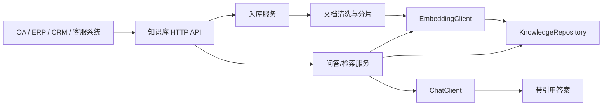

# Java 存量系统 AI 知识库增强

这是一个面向 OA、ERP、CRM、客服、培训和内部文档系统的企业知识库/RAG 参考实现。目标不是替换老系统，而是在存量系统旁边增加一个“能问会答、能检索、带来源”的 AI 能力层。

当前实现无需 Maven/Gradle，使用 Java 21 标准库即可运行，便于在空环境或老系统旁快速验证。生产落地时可以保留应用层接口，把 HTTP 层迁到 Spring Boot，把文件向量库替换为 pgvector、Milvus、Elasticsearch 或企业现有搜索平台。

## 能力范围

- 文档问答：制度、SOP、产品资料、培训材料入库后可提问。
- 制度查询：支持部门、分类、负责人等元数据过滤。
- 产品资料检索：返回语义相关片段。
- 工单/FAQ 语义搜索：FAQ 可独立入库，也可和文档统一召回。
- 带引用来源回答：每个答案返回 `citations`，包含文档 ID、片段 ID、标题、来源 URI、段落号和得分。
- 可替换 AI 供应商：默认本地 Hashing Embedding + 抽取式回答；配置后可使用 OpenAI-compatible Embedding/Chat API。
- 可选 API Key：设置 `KB_API_KEY` 后接口需要 `X-KB-Api-Key`。

## 快速运行

```powershell
.\scripts\test.ps1
.\scripts\run.ps1
```

服务启动后默认监听：

```text
http://localhost:8080
```

示例请求见 [examples/requests.http](D:/Work/Codex/存量系统AI增强/examples/requests.http)。

## 核心接口

`POST /api/documents`

```json
{
  "title": "差旅报销制度",
  "sourceUri": "oa://docs/finance/travel-policy",
  "sourceType": "POLICY",
  "department": "财务",
  "category": "制度",
  "tags": ["报销", "差旅"],
  "content": "员工差旅报销需要提交审批单、发票和行程单..."
}
```

`POST /api/faqs`

```json
{
  "question": "CRM 客户资料如何查询？",
  "answer": "进入 CRM 客户中心，通过客户名称、手机号或企业统一社会信用代码检索。",
  "sourceUri": "faq://crm/customer-search",
  "department": "销售"
}
```

`POST /api/search`

```json
{
  "query": "住宿报销需要哪些材料",
  "topK": 5,
  "filters": {
    "department": "财务"
  }
}
```

`POST /api/ask`

```json
{
  "question": "差旅住宿报销怎么处理？",
  "topK": 5
}
```

## 配置

| 环境变量 | 默认值 | 说明 |
| --- | --- | --- |
| `SERVER_PORT` | `8080` | HTTP 服务端口 |
| `KB_STORAGE_DIR` | `data/knowledge-base` | 本地知识库数据目录 |
| `KB_API_KEY` | 空 | 非空时启用接口 API Key |
| `AI_PROVIDER` | `local` | `local` 或 `openai-compatible` |
| `LOCAL_EMBEDDING_DIMENSIONS` | `384` | 本地 Hashing Embedding 维度 |
| `CHUNK_MAX_TOKENS` | `520` | 文档分片最大 token 估算 |
| `CHUNK_OVERLAP_TOKENS` | `80` | 分片重叠 token 估算 |
| `OPENAI_BASE_URL` | `https://api.openai.com` | OpenAI-compatible 服务地址 |
| `OPENAI_API_KEY` | 空 | AI 供应商 API Key |
| `OPENAI_EMBEDDING_MODEL` | `text-embedding-3-small` | Embedding 模型名 |
| `OPENAI_CHAT_MODEL` | `gpt-4o-mini` | Chat 模型名 |

切换到 OpenAI-compatible：

```powershell
$env:AI_PROVIDER = "openai-compatible"
$env:OPENAI_API_KEY = "你的 API Key"
.\scripts\run.ps1
```

## 架构



代码边界：

- `application`：业务编排，包括入库、分片、检索、问答。
- `domain`：知识文档、片段、引用、响应模型。
- `ports`：可替换端口，包含 `EmbeddingClient`、`ChatClient`、`KnowledgeRepository`。
- `infrastructure`：文件存储、本地向量、OpenAI-compatible 适配器。
- `http`：轻量 HTTP JSON API。

更完整的集成路线见 [docs/architecture.md](D:/Work/Codex/存量系统AI增强/docs/architecture.md)。

## 生产落地建议

- 鉴权：接入老系统 SSO/OAuth2 或 API Gateway，不建议只依赖 `KB_API_KEY`。
- 数据同步：从 OA 附件库、ERP 主数据、CRM FAQ、客服工单定时同步，记录 `sourceUri` 以便回跳原系统。
- 向量库：数据量超过数万片段后，用 pgvector/Milvus/Elasticsearch 替换 `FileKnowledgeRepository`。
- 权限过滤：把用户部门、岗位、数据域映射到 `filters`，在召回前过滤，避免越权问答。
- 审计：记录问题、命中文档、引用、模型输出和用户反馈，便于质检与持续优化。
- 灰度：先接制度/FAQ 等低风险场景，再扩展到工单辅助、客户资料和业务办理助手。
