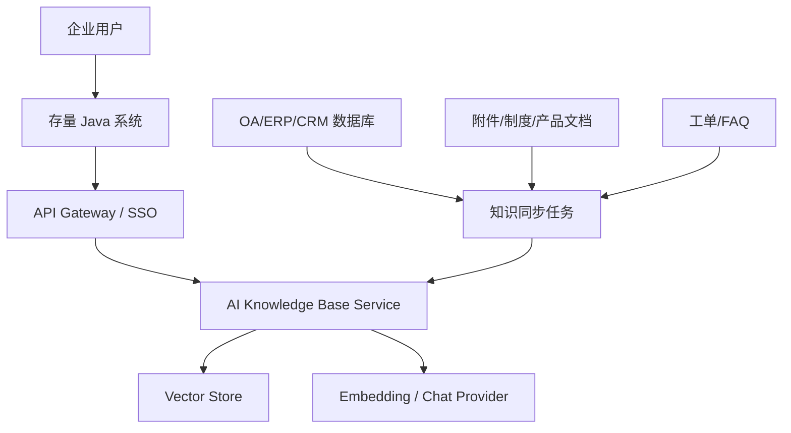

# 架构与落地路线

## 1. 系统定位

本模块定位为“存量系统 AI 能力旁路层”。老系统保持原业务流程和数据库不变，通过 REST API 或网关调用知识库能力：

- 老系统负责用户、权限、流程和原始数据。
- AI 知识库负责知识清洗、分片、向量检索、引用组织和回答生成。
- 每条知识保留 `sourceUri`，答案可回跳到 OA 文档、CRM FAQ、ERP 资料或客服工单。

## 2. 推荐部署拓扑

## 3. 核心数据流

1. 入库：文档、FAQ、制度、工单通过 `/api/documents` 或 `/api/faqs` 写入。
2. 清洗：统一换行、空白、标题、来源、元数据。
3. 分片：按段落/句子切片，保留少量上下文重叠。
4. 向量化：调用 `EmbeddingClient`，默认本地 Hashing，生产可换模型服务。
5. 存储：当前为 JSONL 文件，生产替换为向量库。
6. 查询：问题向量化，先权限/元数据过滤，再相似度召回。
7. 回答：把召回片段交给 `ChatClient`，要求模型只基于资料回答并输出引用编号。
8. 返回：答案 + citations，前端展示引用并可回跳原系统。

## 4. 老系统接入方式

### 页面入口

- 在 OA/ERP/CRM 顶部导航或侧边栏增加“智能问答”入口。
- 前端调用 `/api/ask`，展示答案和引用。
- 引用点击时根据 `sourceUri` 跳转到原系统文档、FAQ 或业务记录。

### 后端接口

- 老系统后端通过服务账号调用知识库 API。
- 把当前用户的数据权限转成 `filters`，例如 `department=财务`、`tenantId=A01`、`securityLevel=internal`。
- 对高风险问题可只返回检索结果，不直接生成答案。

### 同步任务

- 新增或修改制度文档后触发入库。
- 每晚批处理同步 FAQ、产品资料、历史工单。
- 对删除或下线文档调用 `DELETE /api/documents/{id}`。

## 5. 权限模型

最小可用方案：

- 文档入库时写入 `department`、`category`、`owner`、`tenantId`、`securityLevel`。
- 查询时根据登录用户上下文生成 `filters`。
- 回答层只使用过滤后的片段，避免模型看到无权限资料。

生产增强：

- 引入 ABAC/RBAC 策略服务。
- 在向量库 metadata filter 层实现权限裁剪。
- 审计每次查询的用户、问题、命中文档和引用。

## 6. 可替换扩展点

| 扩展点 | 当前实现 | 生产建议 |
| --- | --- | --- |
| `EmbeddingClient` | `HashingEmbeddingClient` / OpenAI-compatible | 企业模型网关、私有 embedding 服务 |
| `ChatClient` | 抽取式回答 / OpenAI-compatible | 企业模型网关、私有大模型 |
| `KnowledgeRepository` | JSONL 文件 | pgvector、Milvus、Elasticsearch、OpenSearch |
| HTTP 层 | JDK HttpServer | Spring Boot Controller + Spring Security |
| 文档解析 | 纯文本入库 | Tika、PDF/Word/Excel 解析流水线 |

## 7. 质量与治理

- 引用覆盖率：答案必须带引用；无引用时提示未找到依据。
- 命中质量：记录用户点赞/点踩，优化分片、同义词、重排。
- 内容新鲜度：保存 `contentHash`，内容变化才重建向量。
- 成本控制：FAQ 和短制度可先走检索直出，复杂问题再调用模型。
- 风险控制：对合同、财务、人事等敏感场景设置更高阈值和人工确认。
